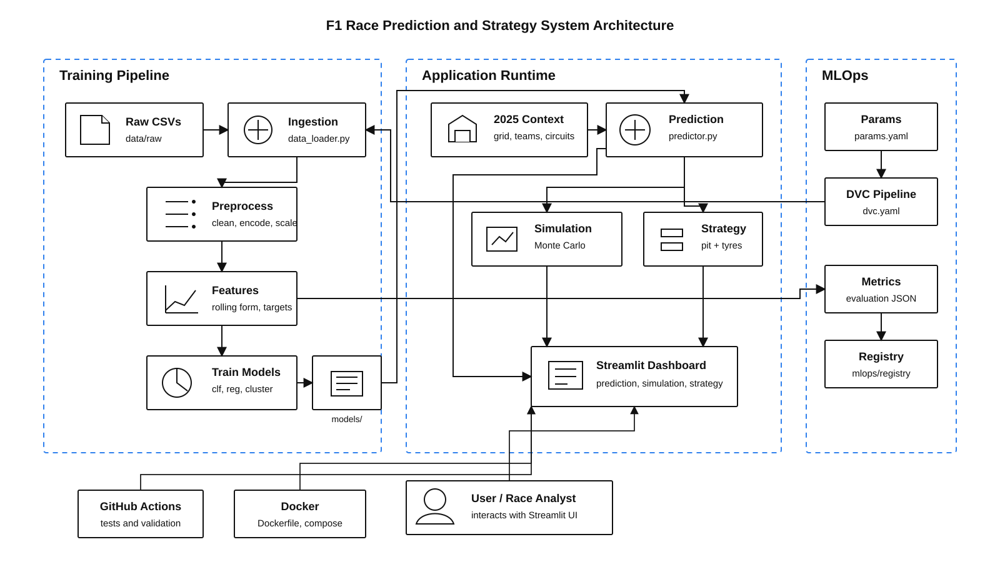

# F1 Race Prediction & Strategy System

<p align="center">
  <strong>Predict race outcomes. Simulate the grid. Build weather-aware pit strategies.</strong>
</p>

<p align="center">
  <a href="https://github.com/ParthrChandurkar/F1-Race-Prediction-Strategy-System/actions/workflows/ci.yml"></a>
  
  
  
</p>

An end-to-end Formula 1 analytics application that combines trained
scikit-learn models, Monte Carlo simulation, circuit characteristics, and tyre
degradation rules in an interactive Streamlit dashboard. The bundled race
configuration targets the 2025 season.

---

## Table of Contents

- [Project Overview](#project-overview)
- [Quick Start](#quick-start)
- [Weather-Aware Strategy](#weather-aware-strategy)
- [Architecture](#architecture)
- [Dataset](#dataset)
- [Folder Structure](#folder-structure)
- [Installation](#installation)
- [Running the Project](#running-the-project)
- [UI Pages](#ui-pages)
- [DVC Pipeline](#dvc-pipeline)
- [Docker](#docker)
- [Tests](#tests)
- [ML Models](#ml-models)
- [Features Used](#features-used)
- [CI/CD](#cicd)
- [Troubleshooting](#troubleshooting)
- [Future Scope](#future-scope)

---

## Project Overview

This project uses historical Formula 1 data from 2000-2024 to train machine
learning models that predict future 2025 race outcomes.

**What it does:**

- Predicts finishing order, Top 10 probability, podium probability, and win probability for the 2025 grid.
- Uses Random Forest classification and Ridge regression as the main future-race prediction stack.
- Runs Monte Carlo race simulations with win, podium, Top 10, DNF, and average-finish probabilities.
- Recommends weather-safe tyre compounds, stop counts, pit windows, safety-car responses, and undercut strategy.
- Compares viable plans using circuit-specific pit loss and tyre degradation, then exports the selected pit plan to CSV.
- Provides driver, team, feature, model-performance, and historical-analysis dashboard pages.
- Supports both one-shot training and a reproducible DVC pipeline.

**Bundled 2025-style grid constants include:**

Hamilton at Ferrari, Antonelli at Mercedes, Sainz at Williams, Lawson at Racing
Bulls, Doohan at Alpine, and 24 configured circuits.

## Quick Start

```bash
git clone https://github.com/ParthrChandurkar/F1-Race-Prediction-Strategy-System.git
cd F1-Race-Prediction-Strategy-System
python -m venv venv
```

Activate the environment (`.\venv\Scripts\Activate.ps1` on Windows or
`source venv/bin/activate` on macOS/Linux), then run:

```bash
pip install -r requirements.txt
streamlit run app.py
```

Open <http://localhost:8501>. The checked-in model artifacts support dashboard
inference immediately; raw CSV files are only required when retraining.

## Weather-Aware Strategy

The Strategy Centre now changes its compound plan based on the forecast instead
of merely displaying a weather warning:

| Forecast | Strategy behavior |
|---|---|
| Dry / Cloudy | Evaluates Soft, Medium, and Hard one-to-three-stop plans |
| Light Rain | Starts on Intermediates and evaluates crossover plans as the track dries |
| Heavy Rain | Prioritizes Full Wet stints with Wet-to-Intermediate crossover alternatives |

Every recommendation includes pit windows, risk, Safety Car guidance, undercut
potential, estimated time loss, and delta to the fastest simulated plan. Use
**Download Pit Plan (CSV)** to take the stop schedule out of the dashboard.

During a race, set **Current Race Lap** and **Stops Already Completed** to get a
live engineer call: hold, prepare, window open, box, overdue, or complete. See
the [strategy engine guide](docs/strategy-engine.md) for Python examples and the
full status contract. The dashboard also tracks the current compound, laps
remaining, and race progress; CSV exports preserve the live engineer call.

---

## Architecture

The system has three main paths:

- **Training path:** raw CSVs are merged, cleaned, encoded, feature engineered, and used to train 9 models.
- **Inference path:** the Streamlit UI calls prediction, simulation, and strategy modules backed by saved artifacts.
- **MLOps path:** DVC, params, experiment logs, registry metadata, CI, and Docker keep the workflow reproducible.

<p align="center">
  
</p>

### Runtime Flow

1. The user selects a circuit, weather, grid assumptions, and simulation settings in `app.py`.
2. `src/predictor.py` loads the saved scaler, encoders, Random Forest classifier, and Ridge regressor from `models/`.
3. `src/f1_2024_data.py` supplies driver/team ratings and circuit metadata for future 2025 predictions.
4. Predictions feed `src/simulator.py` for Monte Carlo results and `src/strategy.py` for pit/tyre recommendations.
5. Metrics, feature importance, model artifacts, and processed data are displayed back in the Streamlit UI.

### Training Flow

1. `src/data_loader.py` reads and merges the required Kaggle CSV files.
2. `src/preprocessing.py` cleans rows, imputes missing values, label-encodes categories, and scales features.
3. `src/feature_engineering.py` adds rolling form, win-rate, Top 10, Top 3, and grid-delta features.
4. `src/train_models.py` or `ml_pipeline/train.py` trains classifiers, regressors, and K-Means.
5. `ml_pipeline/evaluate.py` writes metrics, feature importance, and registers the best classifier.

---

## Dataset

Source: <https://www.kaggle.com/datasets/rohanrao/formula-1-world-championship-1950-2020>

Place these required files in `data/raw/`:

```text
results.csv
races.csv
drivers.csv
constructors.csv
qualifying.csv
pit_stops.csv
lap_times.csv
circuits.csv
```

The repository also includes additional raw F1 tables, but the core loader uses
the eight files listed above.

---

## Folder Structure

```text
f1-ml-project/
|-- app.py                         Streamlit web app with 8 pages
|-- requirements.txt               Python dependencies
|-- params.yaml                    DVC-tracked configuration
|-- dvc.yaml                       5-stage DVC pipeline
|-- Dockerfile                     Streamlit container image
|-- docker-compose.yml             App and optional training services
|-- Makefile                       Common local commands
|-- install.ps1 / install.bat      Windows install helpers
|-- SETUP_WINDOWS.md               Windows setup notes
|
|-- src/
|   |-- f1_2024_data.py            2025 grid, circuits, skill, team ratings
|   |-- data_loader.py             Loads and merges raw CSV tables
|   |-- preprocessing.py           Cleans, encodes, scales, selects features
|   |-- feature_engineering.py     Rolling averages, win rate, targets
|   |-- train_models.py            One-shot training script
|   |-- evaluate_models.py         Evaluation report helper
|   |-- predictor.py               Future race prediction engine
|   |-- simulator.py               Monte Carlo simulation
|   `-- strategy.py                Pit stop and tyre strategy engine
|
|-- ml_pipeline/
|   |-- data_ingestion.py          DVC stage 1
|   |-- preprocessing.py           DVC stage 2
|   |-- feature_engineering.py     DVC stage 3
|   |-- train.py                   DVC stage 4
|   `-- evaluate.py                DVC stage 5
|
|-- mlops/
|   |-- model_registry/
|   |   |-- register_model.py      Local JSON model registry API
|   |   `-- registry.json          Registered model metadata
|   `-- experiments/               Training run logs
|
|-- tests/
|   |-- test_data_loading.py
|   |-- test_model_files.py
|   `-- test_prediction.py
|
|-- docs/
|   |-- architecture.md
|   |-- architecture-diagram.svg
|   `-- strategy-engine.md         Strategy API and live-status guide
|
|-- data/
|   |-- raw/                       Kaggle CSV input files
|   `-- processed/                 Generated pipeline outputs
|
`-- models/                        Trained models, encoders, metrics, metadata
```

---

## Installation

### Step 1 - Create a virtual environment

```bash
python -m venv venv
```

Windows PowerShell:

```powershell
.\venv\Scripts\Activate.ps1
```

macOS / Linux:

```bash
source venv/bin/activate
```

### Step 2 - Install dependencies

Normal networks:

```bash
pip install -r requirements.txt
```

College or corporate networks with SSL issues:

```powershell
.\install.ps1
```

Manual trusted-host fallback:

```powershell
pip install scikit-learn numpy pandas joblib streamlit plotly dvc pyyaml pytest matplotlib seaborn --trusted-host pypi.org --trusted-host files.pythonhosted.org --trusted-host pypi.python.org
```

Permanent Windows pip SSL workaround:

```ini
# C:\Users\YourName\pip\pip.ini
[global]
trusted-host =
    pypi.org
    files.pythonhosted.org
    pypi.python.org
```

---

## Running the Project

### Step 1 - Place CSV files

Copy the required Kaggle CSV files into `data/raw/`.

### Step 2 - Train models

```bash
python src/train_models.py
```

Expected high-level output:

```text
[1/6] Loading raw CSVs ...
[2/6] Cleaning ...
[3/6] Encoding categoricals ...
[4/6] Engineering features ...
[5/6] Splitting train/test ...
[6/6] Training models ...
ALL MODELS TRAINED AND SAVED
```

### Step 3 - Launch the app

```bash
streamlit run app.py
```

Open: <http://localhost:8501>

---

## UI Pages

| Page | What it does |
|---|---|
| Dashboard | Shows the 2025 driver grid, team ratings, high-level system overview, and core modules. |
| Race Prediction | Predicts full-grid finishing order, Top 10 probability, podium probability, and win probability for a selected circuit. |
| Feature Analysis | Explores qualifying/grid impact and feature contribution patterns. |
| Race Simulation | Runs Monte Carlo simulations using prediction probabilities, DNF risk, and circuit overtaking profile. |
| Strategy Centre | Builds weather-aware pit plans, gives live lap-by-lap engineer calls, compares losses, and exports the schedule. |
| Driver Analysis | Shows historical driver statistics, form, circuit performance, and skill comparison. |
| Team Analysis | Shows constructor trends, driver stats, and 2025 lineup comparisons. |
| Model Performance | Displays model metrics, confusion matrices, regression scores, and feature importance. |

---

## DVC Pipeline

Run the full reproducible ML pipeline:

```bash
dvc repro
```

Pipeline stages:

| Stage | Script | Main output |
|---|---|---|
| `data_ingestion` | `ml_pipeline/data_ingestion.py` | `data/processed/ingested_master.csv` |
| `preprocessing` | `ml_pipeline/preprocessing.py` | `data/processed/master.csv` |
| `feature_engineering` | `ml_pipeline/feature_engineering.py` | `data/processed/featured_master.csv` |
| `train` | `ml_pipeline/train.py` | model `.pkl` files, encoders, scaler, `meta.json` |
| `evaluate` | `ml_pipeline/evaluate.py` | `metrics.json`, `feature_importance.json`, registry entry |

Useful commands:

```bash
dvc init -f
dvc repro
dvc status
```

Change a value in `params.yaml`, then run `dvc repro` to rerun only the affected
stages.

---

## Docker

Build and run the Streamlit app:

```bash
docker build -t f1-ml-app .
docker-compose up --build
```

Open: <http://localhost:8501>

Stop containers:

```bash
docker-compose down
```

Optional training profile:

```bash
docker-compose --profile train up
```

---

## Tests

```bash
pytest tests/ -v --tb=short
```

The GitHub Actions workflow also runs syntax checks, selected simulation and
strategy tests, parameter validation, DVC validation, and model-registry checks.

---

## ML Models

### Classification

Predicts whether a driver finishes in the Top 10.

| Model | Artifact |
|---|---|
| Random Forest | `models/Random_Forest.pkl` |
| SVM | `models/SVM.pkl` |
| Logistic Regression | `models/Logistic_Regression.pkl` |
| Decision Tree | `models/Decision_Tree.pkl` |
| Naive Bayes | `models/Naive_Bayes.pkl` |

### Regression

Predicts finishing position from 1-20.

| Model | Artifact |
|---|---|
| Ridge Regression | `models/Ridge_Regression.pkl` |
| Linear Regression | `models/Linear_Regression.pkl` |
| Lasso Regression | `models/Lasso_Regression.pkl` |

### Unsupervised

| Model | Purpose |
|---|---|
| K-Means | Groups drivers/races into performance-style clusters. |

---

## Features Used

| Feature | Source | Type |
|---|---|---|
| `grid` | `results.csv` | Raw |
| `qual_position` | `qualifying.csv` | Raw |
| `year` | `races.csv` | Raw |
| `driverRef_enc` | `drivers.csv` | Encoded |
| `constructorRef_enc` | `constructors.csv` | Encoded |
| `circuitRef_enc` | `circuits.csv` | Encoded |
| `driver_avg_finish` | Computed | Rolling 5-race form |
| `team_avg_finish` | Computed | Rolling 5-race constructor form |
| `driver_win_rate` | Computed | Rolling 10-race win rate |
| `pit_stop_count` | `pit_stops.csv` | Aggregated |
| `avg_lap_ms` | `lap_times.csv` | Aggregated |

---

## CI/CD

GitHub Actions runs on pushes and pull requests.

Main checks:

1. Required project files exist.
2. Python modules compile.
3. `params.yaml` contains the expected structure.
4. `dvc.yaml` has all five stages and no duplicate outputs.
5. Selected simulation and strategy tests pass.
6. The local model registry module can load registry entries.
7. Docker project files exist.

---

## Troubleshooting

| Problem | Fix |
|---|---|
| SSL certificate error during install | Use `.\install.ps1` or configure `pip.ini` with trusted hosts. |
| `No module named joblib` | Install dependencies again with the trusted-host command above. |
| DVC duplicate output error | Keep `metrics.json` only in the `evaluate` stage metrics section. |
| Models not found in app | Run `python src/train_models.py` or `dvc repro` first. |
| Port 8501 busy | Run `streamlit run app.py --server.port 8502`. |
| Docker app starts without predictions | Train models first so `models/` contains the required artifacts. |

---

## Future Scope

- MLflow visual experiment tracking.
- Remote DVC storage such as Google Drive or S3.
- Live race-data integration.
- Weather API integration for dynamic strategy adjustment.
- Lap-by-lap neural forecasting.
- Production deployment with Kubernetes or a managed container platform.
